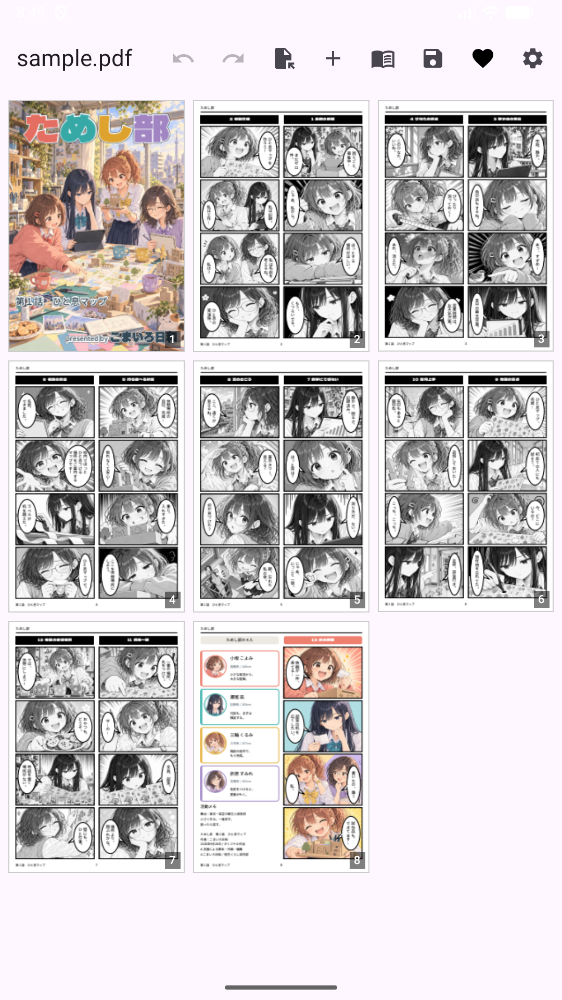
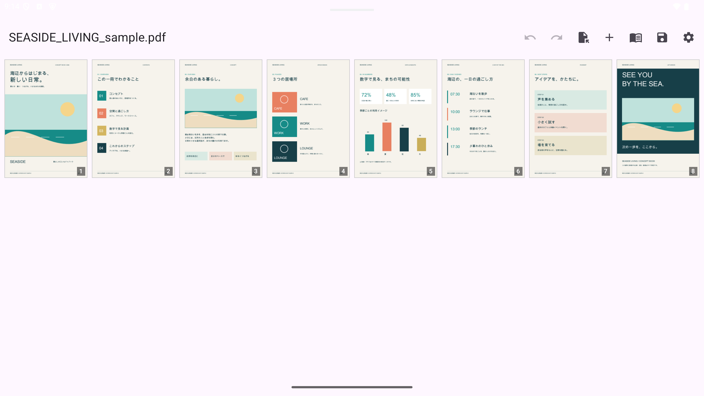
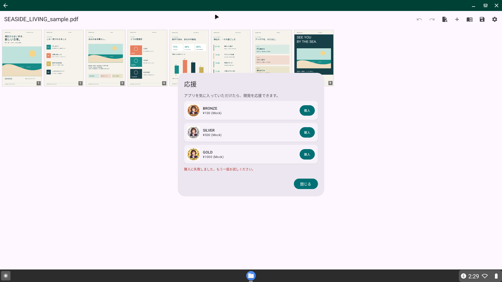

# 見開きPDFユーティリティ (Android)

Android向けの強力で直感的なPDFユーティリティアプリです。**見開き（2ページスプレッド表示）**に特化しており、自炊した書籍、漫画、ビジネス文書の管理に最適です。

[**Webサイト (日本語)**](https://tyamada.github.io/MihirakiPDFUtility_Android/) | [**English Website**](https://tyamada.github.io/MihirakiPDFUtility_Android/index_en.html) | [**English README (README.md)**](README.md)

## 🚀 主な機能

| 機能 | 説明 |
| :--- | :--- |
| 📖 **見開き表示** | 2ページを横並びで表示。日本の書籍や漫画に合わせた「右開き（RTL）」にも完全対応しています。 |
| ✂️ **スマートページ分割** | 見開き1ページを2つのページに分割。垂直（左右）と水平（上下）の両方の分割方向をサポートします。 |
| 🔀 **ドラッグ＆ドロップ並べ替え** | サムネイルをドラッグするだけでページ順序を整理。直感的なインターフェースで編集が捗ります。 |
| ➕ **結合と追加** | 複数のPDFファイルを1つに結合したり、既存のPDFにページを追加したりできます。 |
| 🔒 **セキュリティ** | 暗号化されたPDFのパスワード保護や、メタデータの編集が可能です。 |
| 🖥️ **クロスデバイス対応** | スマートフォン、タブレット、ChromeOS（デスクトップ環境）で快適に動作するよう最適化されています。 |

### 機能紹介

### 画面イメージ

各デバイスでの動作例：

| デバイス | 表示 | 画像 |
| :--- | :--- | :--- |
| **スマートフォン** | 見開き表示 |  |
| **タブレット** | ページ分割 |  |
| **ChromeOS** | デスクトップUI |  |

## 🌐 多言語サポート

日本語、英語、韓国語、中国語、ドイツ語、フランス語、スペイン語、ポルトガル語、ベトナム語、タガログ語、ネパール語、インドネシア語など13言語に対応しています。

## サンプルPDF

アプリでお試しいただけるサンプルPDF（マンガ）をダウンロードできます：

- [THE TRY-IT CLUB EPISODE 1: THE BREAK-TIME MAP (English)](https://github.com/tyamada/MihirakiPDFUtility_Android/raw/main/testdata/tameshibu_episode1_en.pdf)
- [THE TRY-IT CLUB EPISODE 2: ROOM TO GROW (English)](https://github.com/tyamada/MihirakiPDFUtility_Android/raw/main/testdata/tameshibu_episode2_en.pdf)
- [ためし部 第１話 ひと息マップ (Japanese)](https://github.com/tyamada/MihirakiPDFUtility_Android/raw/main/testdata/tameshibu_episode1_ja.pdf)
- [ためし部 第２話 机、ひろがる。 (Japanese)](https://github.com/tyamada/MihirakiPDFUtility_Android/raw/main/testdata/tameshibu_episode2_ja.pdf)
- [해봄부 제1화 한숨 돌림 지도 (Korean)](https://github.com/tyamada/MihirakiPDFUtility_Android/raw/main/testdata/tameshibu_episode1_ko.pdf)
- [해봄부제2화 책상이 넓어지다 (Korean)](https://github.com/tyamada/MihirakiPDFUtility_Android/raw/main/testdata/tameshibu_episode2_ko.pdf)
- [试试社 第1话 歇口气地图 (Chinese (Simplified))](https://github.com/tyamada/MihirakiPDFUtility_Android/raw/main/testdata/tameshibu_episode1_zh_cn.pdf)
- [试试社 第2话 桌子变大了 (Chinese (Simplified))](https://github.com/tyamada/MihirakiPDFUtility_Android/raw/main/testdata/tameshibu_episode2_zh_cn.pdf)

## 技術スタック

*   **UI**: Jetpack Compose (Material 3)
*   **アーキテクチャ**: MVVM (ViewModel, StateFlow)
*   **PDF処理**: [PdfBox-Android](https://github.com/TomRoush/PdfBox-Android)
*   **言語**: Kotlin

## ライセンス

Apache License 2.0
